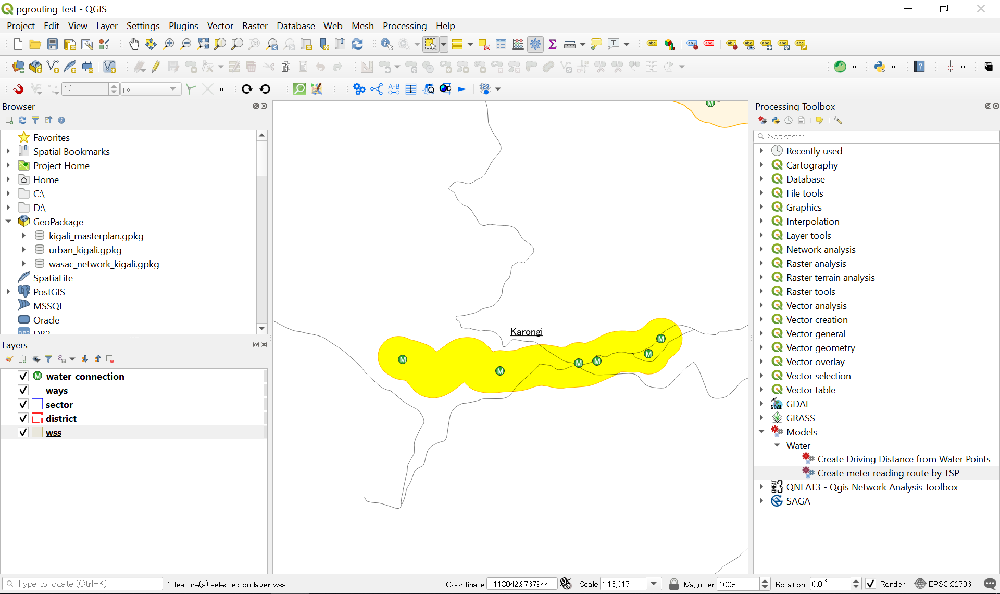

# Instructions for calculating water access area and meter reading route by QGIS3

## Extract ZIP file of Geopackage under project folder.


## Install .model3 and .qml file for graphic modeler of QGIS3

First, you need to copy .model3 and .qml file to QGIS's modeler folder. The default path of modeler folder is as follow.

```
%userprofile%\AppData\Roaming\QGIS\QGIS3\profiles\default\processing\models
```


------

## How to calculate water access area from water points

Second, you need to install QNEAT3 plugin on QGIS3.


Calculate water access area from water points by modeler.

1. Select target area.
2. Processing --> Toolbox --> Models --> Water --> Create Driving Distance from Water Points
3. Run after selecting road layer and water points layer!


The following figure is the result of calculation.


The following figure describes how the modeler was built.


------

## How to create meter reading route by TSP algorithm

First, please open QGIS Desktop 3.10.0 with GRASS 7.6.1.

Don't use QGIS Desktop without GRASS tool.

1. Select target area from WSS layer (Polygon layer).

   

2. Run Processing --> Toolbox --> Models --> Water --> Create meter reading route by TSP.

   

3. Styling network salesman layer to make it be beautiful after completing to run the modeler.

   

The following figure describes how the modeler was built.


------
This tools were developed by ````Jin IGARASHI, JICA Expert```` from ````The Project for Strengthening Operation and Maintenance of Rural Water Supply Systems in Rwanda- RWASOM````.